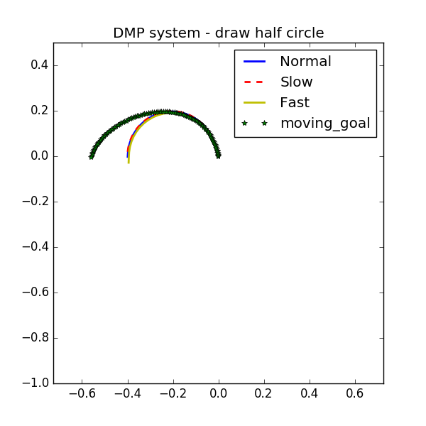
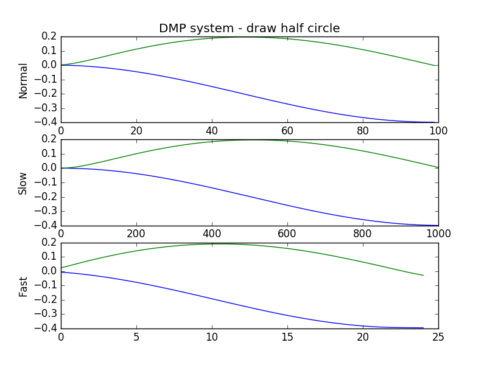
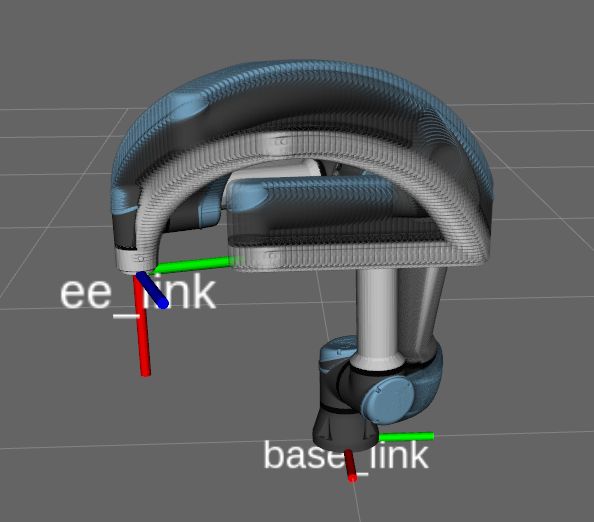

# Dillinger

[](https://nodesource.com/products/nsolid)

[](https://travis-ci.org/joemccann/dillinger)

This repository is build based on the following two repositories, one for the ur5e simulation, the other one is for the dmp approach. This code is build for personal learning, so there is no guarantee for the bugs free. For those who want to understand the dmp, I strongly refer to these blogs: [https://studywolf.wordpress.com/2013/11/16/dynamic-movement-primitives-part-1-the-basics/]

  - [https://github.com/studywolf/pydmps][pydmps] 
  - [https://github.com/ros-industrial/universal_robot][universal robot]

# Install

  - Install the universal robot package follow the link above
  - Install the pydmps
```
pip install pydmps
```
  - Download this repository
```
git clone https://github.com/Shaluols/ur5e_dmp.git
```

# Test

Start the gazebo and moveit.
```
roslaunch ur_e_gazebo ur5e.launch limited:=true
roslaunch ur5_e_moveit_config ur5_e_moveit_planning_execution.launch sim:=true
roslaunch ur5_e_moveit_config moveit_rviz.launch config:=true
```
You can define your own trajectory in the *produce_demon_traj.py* file, or just use the exsit *ee_traj.txt* file, which recorded a half circle path. 
To test the dmp algorithm:
```
python dmp_function_test.py
```
Test result:
The first image is the end_effector trajectory under different speed and goals.
The second image is the y and z change with time, from which we can see the dmp method can be generalized to different time scale.  
<p align="center">
  
</p>
<p align="center">
  
</p>
It contains the temporal scaling, changing goal testing. 
Then, you can test the performance on the ur5e and visualize it in moveit. 
```
python dmp_ur5e_test.py
```
<p align="center">
  
</p>